# Customer Churn Analysis

## Introduction
Customer retention is a crucial challenge in the telecommunications industry. With increasing competition and numerous service options, companies need to understand why customers leave (churn) and how to proactively address their needs.
This analysis explores the Telco Customer Churn dataset, which contains various customer attributes including demographic information, account details, and the services they use. By identifying patterns associated with churn, the business can implement targeted strategies to improve customer loyalty and satisfaction.

## Problem Statement
The increasing churn rate has become a growing concern for the telecom company, as it directly affects revenue and puts pressure on customer acquisition efforts. Understanding why customers are leaving is critical for sustaining long-term growth. This project aims to explore and analyze customer behavior to uncover the key factors contributing to churn and provide actionable insights to help the company enhance customer retention.

 ## Objectives
- Analyze the distribution and characteristics of churned vs. retained customers.
- Explore the impact of demographic variables (e.g., gender, senior citizen status) on churn.
- Examine how account-related features like contract type, tenure, and payment methods relate to customer churn.
- Identify the services (e.g., internet, phone, streaming) most commonly associated with churn.
- Provide initial insights that can guide business decisions to reduce churn.

## Data Description
The Telco Customer Churn dataset contains various customer-related features that can be used to analyze churn. Here's a description of each column:

Column Name        | Description
--------------------|-----------------------------------------------------------------------------------------------------
customerID          | Unique identifier for each customer.
gender              | Customer's gender (male/female).
SeniorCitizen       | Whether the customer is a senior citizen (1 = Yes, 0 = No).
Partner             | Whether the customer has a partner (Yes/No).
Dependents          | Whether the customer has dependents (Yes/No).
tenure              | Number of months the customer has been with the company.
PhoneService        | Whether the customer has phone service (Yes/No).
MultipleLines       | Whether the customer has multiple lines (Yes/No/No phone service).
InternetService     | Type of internet service customer uses (DSL/Fiber optic/No).
OnlineSecurity      | Whether the customer has online security (Yes/No/No internet service).
OnlineBackup        | Whether the customer has online backup (Yes/No/No internet service).
DeviceProtection    | Whether the customer has device protection (Yes/No/No internet service).
TechSupport         | Whether the customer has tech support (Yes/No/No internet service).
StreamingTV         | Whether the customer has streaming TV service (Yes/No/No internet service).
StreamingMovies     | Whether the customer has streaming movies service (Yes/No/No internet service).
Contract            | Type of contract the customer has (Month-to-month/One year/Two year).
PaperlessBilling    | Whether the customer has paperless billing (Yes/No).
PaymentMethod       | Method of payment (Electronic check/Mailed check/Bank transfer/Credit card).
MonthlyCharges      | Amount charged to the customer monthly.
TotalCharges        | Total amount charged to the customer (can be empty for customers with zero tenure, might need preprocessing).
Churn               | Whether the customer has churned (Yes/No).

## Dataset Source
The dataset used in this project is the Telco Customer Churn dataset, which is publicly available on Kaggle. It contains information about a telecom company's customers, including demographic details, account information, the services they use, and whether they have churned.

Link: https://www.kaggle.com/datasets/blastchar/telco-customer-churn

## Basic Data Exploration

### Data Type
|   Column          | Dtype   |
|-----------------|---------|
| customerID      | object  |
| gender          | object  |
| SeniorCitizen   | int64   |
| Partner         | object  |
| Dependents      | object  |
| tenure          | int64   |
| PhoneService    | object  |
| MultipleLines   | object  |
| InternetService | object  |
| OnlineSecurity  | object  |
| OnlineBackup    | object  |
| DeviceProtection| object  |
| TechSupport     | object  |
| StreamingTV     | object  |
| StreamingMovies | object  |
| Contract        | object  |
| PaperlessBilling| object  |
| PaymentMethod   | object  |
| MonthlyCharges  | float64 |
| TotalCharges    | object  |
| Churn           | object  |

### Missing Value

| Column            | Missing Value |
|-------------------|---------------|
| customerID        | 0             |
| gender            | 0             |
| SeniorCitizen     | 0             |
| Partner           | 0             |
| Dependents        | 0             |
| tenure            | 0             |
| PhoneService      | 0             |
| MultipleLines     | 0             |
| InternetService   | 0             |
| OnlineSecurity    | 0             |
| OnlineBackup      | 0             |
| DeviceProtection  | 0             |
| TechSupport       | 0             |

### Data Summary

| Statistic | Value      |
|-----------|------------|
| Count     | 7043.000000 |
| Mean      | 64.761692  |
| Std       | 30.090047  |
| Min       | 18.250000  |
| 25%       | 35.500000  |
| 50%       | 70.350000  |
| 75%       | 89.850000  |
| Max       | 118.750000 |

## Exploratory Data Analysis

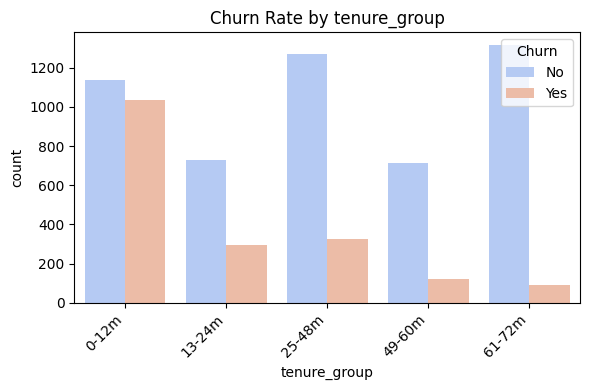

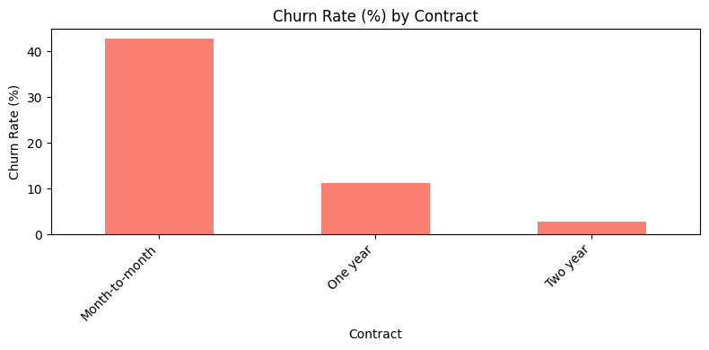

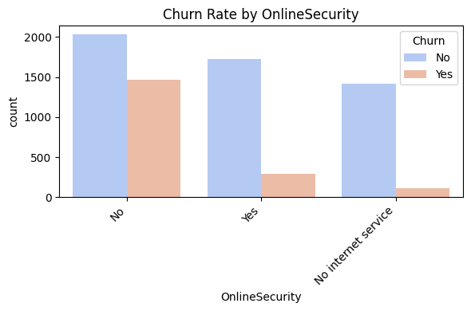

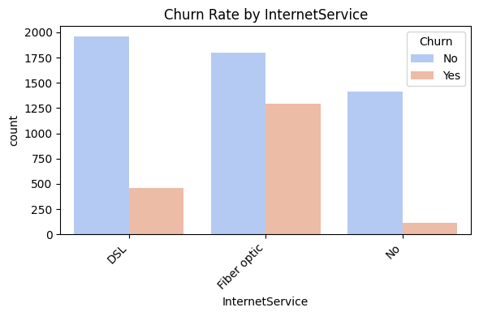

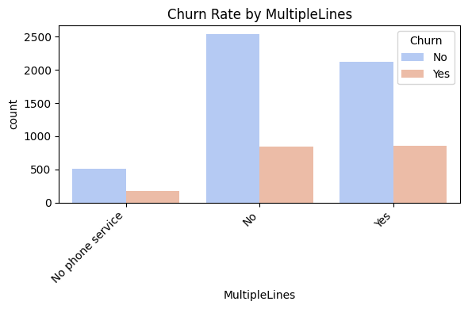

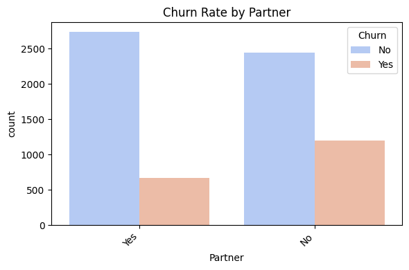

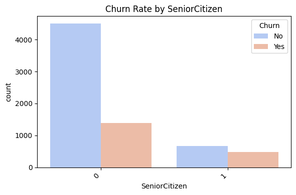

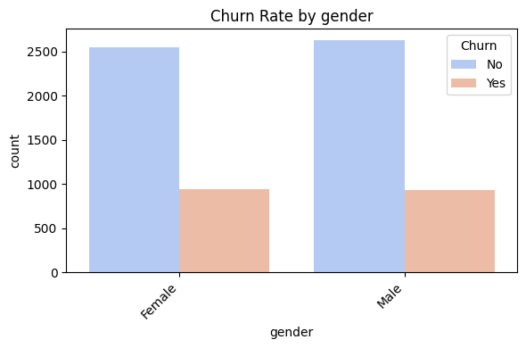

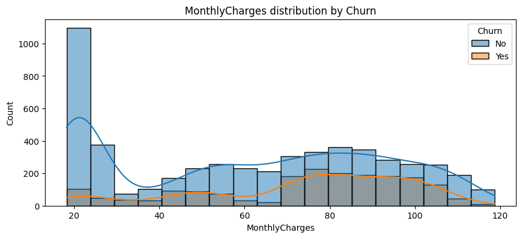
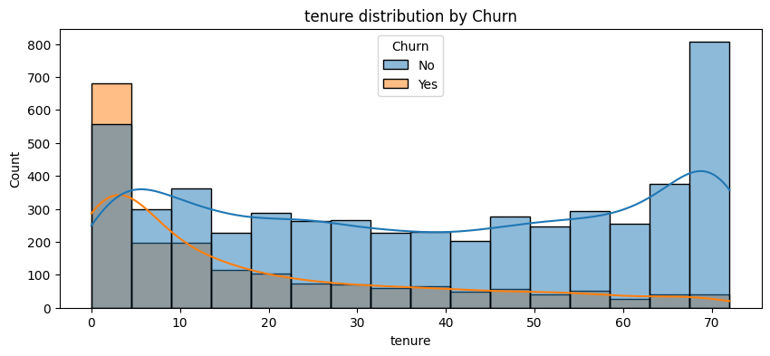
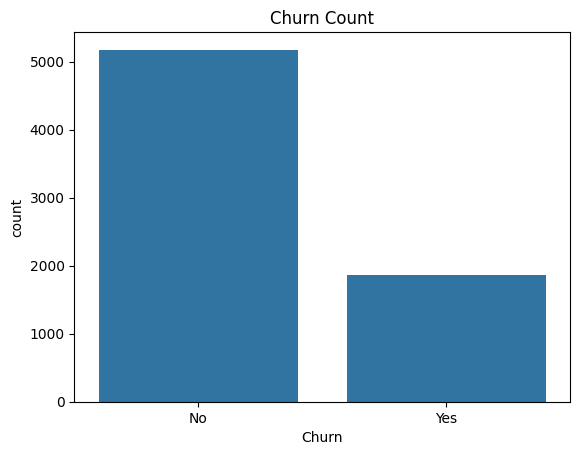
